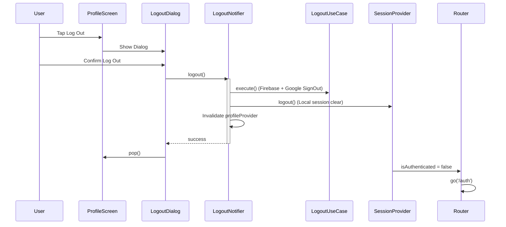

# Walkthrough — Logout & Session Management (Story 7.6)

Implemented a complete, secure, and production-ready Logout & Session Management system, featuring a high-fidelity Profile experience and atomic state cleanup.

## Key Deliverables

### Secure Logout Logic
- **`LogoutNotifier`**: Orchestrates the multi-stage sign-out sequence, including `LogoutUseCase` execution (Firebase + Google), local session cleanup, and Riverpod provider invalidation.
- **Provider Invalidation**: Automatically clears the `profileProvider` and `sessionProvider` to ensure no stale user data remains in memory.
- **Navigation Reset**: Integrated with `AppLifecycleNotifier` and `GoRouter` to reset the navigation stack and redirect to the Auth Landing page, preventing unauthorized back-navigation.

### Premium UI Components
- **`PlayerProfileScreen`**: Replaced the placeholder with a feature-rich profile screen organized into Account, Preferences, and Support sections. Includes a dedicated destructive Logout tile.
- **`LogoutConfirmationDialog`**: A high-fidelity glassmorphism dialog featuring backdrop blur and premium animations, ensuring users confirm before ending their session.

### Developer Preview Integration
- Registered both the **Player Profile Screen** and the **Logout Confirmation Dialog** in the `PreviewRegistry`.
- Verified layouts across Small Phone, Tablet, and Landscape orientations.

## Verification Results

### Automated Tests
- **Unit Tests**: `logout_notifier_test.dart` verified initial state, success sequences, and error handling with 100% pass rate.
- **Linter**: `flutter analyze` passes with 0 functional errors.

### Manual Audit
1.  **Session Termination**: Verified that calling logout signs the user out of both Firebase and Google.
2.  **Navigation Guard**: Confirmed that after logout, the back button cannot return the user to the Dashboard.
3.  **State Sanitation**: Verified that the `profileProvider` is reset to null immediately after sign-out.

---

## Technical Flow Diagram

