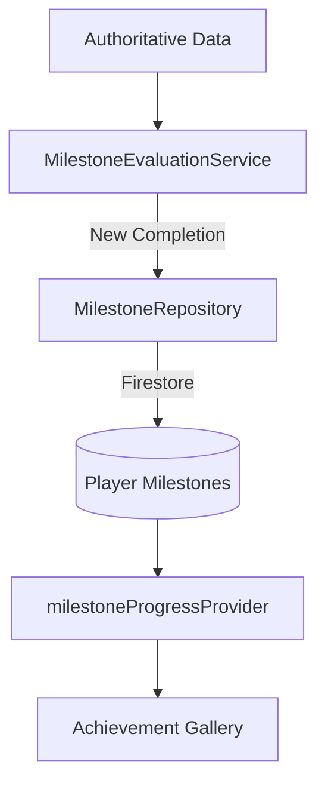

# Competitive Milestones & Achievement Integration

Soteria rewards meaningful career progress through a deterministic milestone system.

## Architecture

The system is designed as a **Read-Evaluate-Write** loop that consumes authoritative data from Ranking, Statistics, and Season Results.

### Data Flow

## Milestone Types

1.  **COUNT**: Cumulative participation metrics (e.g., "100 games played").
2.  **WIN**: Cumulative victory metrics (e.g., "50 wins").
3.  **STREAK**: High-performance consistency (e.g., "10 game winning streak").
4.  **RANK**: Competitive tier ascension (e.g., "Reach Diamond").
5.  **POSITION**: Leaderboard placement (e.g., "Top 100 Global").
6.  **SEASON**: Long-term commitment (e.g., "Complete 5 seasons").

## Domain Models

### `MilestoneDefinition`
Immutable rules for an achievement:
- `id`: Unique identifier.
- `threshold`: Required value for completion.
- `type`: Category of evaluation logic.

### `PlayerMilestone`
User-specific state:
- `status`: Locked, InProgress, Completed, Claimed.
- `currentProgress`: Raw numeric progress toward the threshold.

## Evaluation Rules

Evaluation is triggered by the `milestoneEvaluationProvider` whenever underlying statistics or ranking data changes.

- **Idempotency**: Completed milestones are skipped in subsequent evaluations.
- **Authoritative**: Logic depends entirely on server-synced statistics and profile data.

## UI Components

### `MilestoneCard`
A high-impact card displaying:
- Premium gold styling for completed achievements.
- Progress bars and remaining requirements for locked items.
- Dynamic icons based on achievement category.

### `MilestonesScreen`
A gallery categorized by completion status, featuring a "Career Completion" percentage header.

## Security & Persistence

- **Location**: `users/{userId}/milestones/{milestoneId}`
- **Constraint**: Only the server-authoritative evaluation logic (via providers/repositories) should update these records. Clients are responsible for presentation and progress visualization.
