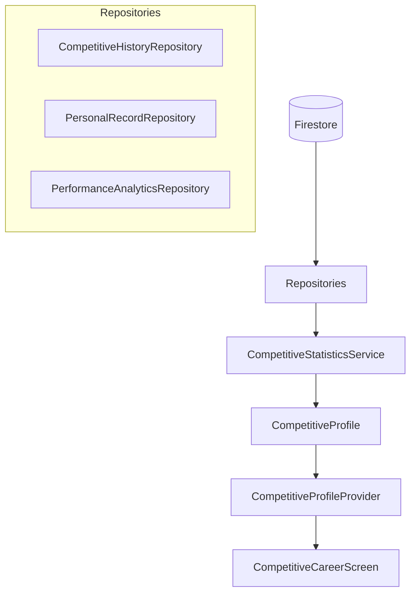

# Competitive Career Analytics

This document describes the architecture and systems for tracking and displaying long-term player progression, personal records, and season-over-season analytics in Soteria.

## Overview

Soteria provides a premium career dashboard that synthesizes authoritative data from several systems:
- **Seasons**: Historical performance from `SeasonResult`.
- **Matches**: Aggregated statistics from `MatchResult`.
- **Records**: Server-authoritative personal bests from `CompetitivePersonalRecord`.
- **Performance**: Detailed question-level analytics from the Performance Engine.

## Core Models

### CompetitiveCareerSummary
Aggregates key metrics across the player's entire career.
- `totalSeasons`: Count of completed seasons.
- `bestRank`: Highest tier reached.
- `bestPosition`: Best global leaderboard placement.
- `winRate`: Overall career win rate.
- `highestScore`: All-time highest single-match score.
- `careerRecords`: List of `CompetitivePersonalRecord` with `isCareerRecord: true`.

### SeasonResult
Historical snapshot of a player's performance at the end of a season.
- `statistics`: Map containing accuracy, win rate, and points for that specific season.

## Architecture

## Security & Privacy

### Server-Authoritative Records
All records (Highest Score, Best Rank, etc.) are generated and validated on the server. The client is only responsible for display. This prevents "record inflation" or spoofed streaks.

### Public vs Private Data
- **Public**: Rank, Tier, Season Results, Global Position, Public Achievements.
- **Private**: Detailed accuracy per category, response time trends, weakness analysis.
- **Enforcement**: Access is controlled via Firestore Security Rules and differentiated Profile models (`PublicCompetitiveProfile` vs `CompetitiveProfile`).

## Performance Optimization

### Aggregation Strategy
To avoid N+1 queries when loading a career profile:
1. `CompetitiveHistory` is loaded once (paginated for long histories).
2. Career-level metrics are stored as a summary document or aggregated at the repository level.
3. Personal records are fetched in a single collection query.

### Caching
- Career summaries are cached in Riverpod and invalidated when a new season ends or a major record is broken.
- Charts (`SeasonTrendChart`) use a lightweight projection of historical rank points.

## Testing

- **Domain Tests**: Verify win rate, best rank, and streak calculations in `CompetitiveStatisticsService`.
- **UI Tests**: Verify responsive layouts for charts and record cards.
- **Golden Tests**: Ensure premium visual consistency across different device sizes.
