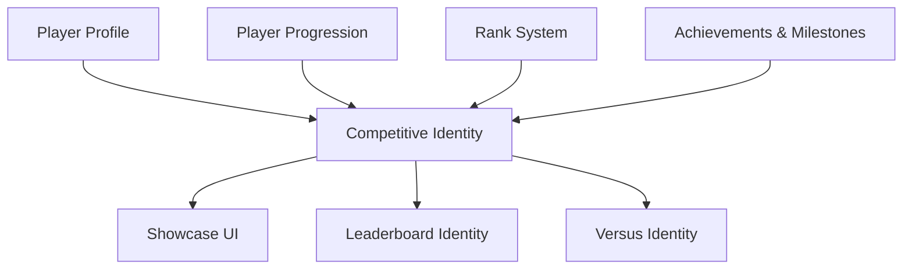

# Competitive Identity, Titles & Badges

Soteria provides a premium competitive identity system that allows players to showcase their achievements, ranks, and earned prestige.

## Architecture

The competitive identity is an aggregate of multiple authoritative systems:

### Source of Truth
- **Identity & Settings**: `PlayerProfile` (Firestore `users` collection).
- **Rank & RP**: `PlayerProgression` (Firestore `player_progression` collection).
- **Definitions**: `IdentityRepository` provides static definitions for Titles and Badges.

## Components

### Competitive Title
Titles are earned through milestones and achievements. Players can equip one active title at a time via the **Showcase Customization**.
- **Model**: `CompetitiveTitle`
- **Storage**: `equippedTitleId` in `PlayerProfile`.

### Featured Badges
Players can select up to 5 earned badges to feature on their profile and in competitive lobbies.
- **Model**: `CompetitiveBadge`
- **Storage**: `featuredBadgeIds` in `PlayerProfile`.

### Identity Showcase
A high-fidelity header and screen that summarizes the player's competitive standing.
- **Header**: `IdentityShowcaseHeader` (Avatar + Rank + Title + Featured Badges).
- **Screen**: `CompetitiveShowcaseScreen` (Detailed statistics, title selection, and badge ordering).

## Integration

- **Leaderboards**: Rows display the player's equipped title alongside their rank.
- **Main Profile**: A compact "Competitive Identity" card provides quick access to the showcase.
- **Versus / Tournaments**: Standardized identity components ensure a consistent "prestige" look across all game modes.

## Customization Flow

1.  **Title Selection**: A bottom sheet fetches all `allOwnedTitles` and allows equipping one.
2.  **Badge Customization**: A grid view of `allOwnedBadges` allows selecting up to 5 to be featured.
3.  **Persistence**: Changes are saved directly to the user's `PlayerProfile` document in Firestore.

## Testing & Preview

- **Preview Gallery**: Navigate to `Screens > Competitive Identity` to view all states (New Player, Elite, Long Names, etc.).
- **Golden Tests**: Coverage for `IdentityShowcaseHeader` and `CompetitiveTitleWidget`.
- **Domain Tests**: Verified ownership logic and selection limits in `identity_providers.dart`.

## Security

- **Ownership Verification**: The UI only displays titles and badges present in the user's `achievements` and `badges` lists, which are granted by server-side logic.
- **Selection Safety**: The client-side controller validates limits (e.g., max 5 badges) before committing to Firestore.
