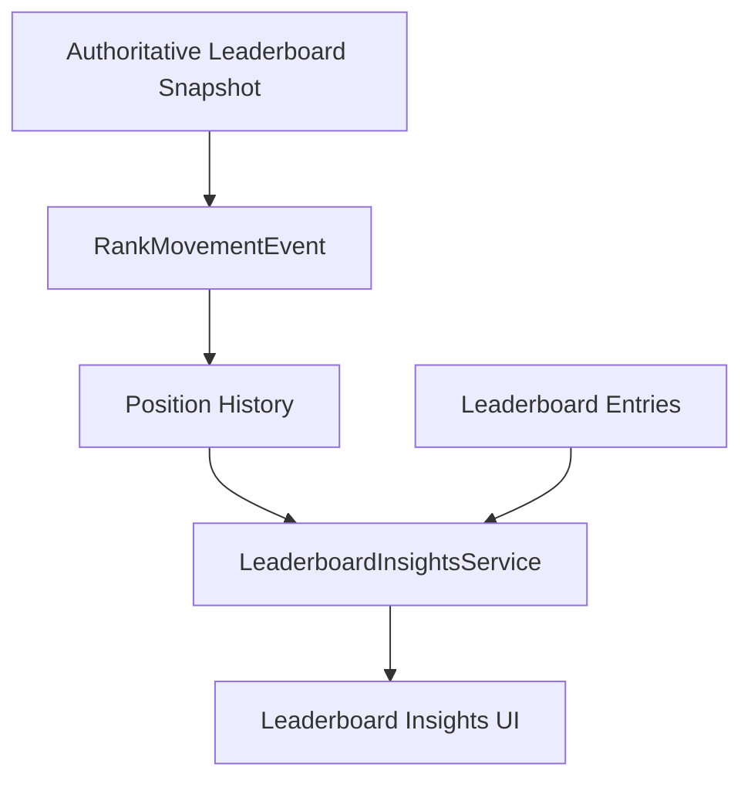

# Competitive Leaderboard Insights & Rank Movement

This system extends the existing leaderboard architecture to provide players with detailed insights into their standing, movement, and progress within the Soteria competitive tiers.

## Architecture

The system follows a reactive flow from authoritative server snapshots down to deterministic client-side insights.

## Core Components

### 1. RankMovementEvent
Tracks changes in leaderboard position over time.
- **Position Delta**: `Previous Position - Current Position`. (Lower numeric position is better).
- **Type**: Improved, Dropped, Maintained, or Initial Placement.

### 2. LeaderboardInsightsService
Generates natural language insights based on data analysis:
- **Percentile**: Calculated as `(Position / Total Players) * 100`.
- **Promotion Proximity**: Detects when a player is within 100 RP of the next tier.
- **Gap Analysis**: Shows RP distance to the player immediately above.
- **Momentum**: Identifies significant shifts (e.g., jumping 10+ positions).

### 3. Leaderboard Neighborhood
Displays a compact view of direct competitors:
- Player immediately above.
- Current player (Self).
- Player immediately below.

## Data Layer (Firestore)

- **Collection**: `rank_movement_history`
- **Indexing**: `userId` (ASC), `seasonId` (ASC), `timestamp` (DESC).
- **Scalability**: Total player count is retrieved using Firestore `aggregate` queries to avoid full collection reads.

## State Management (Riverpod)

- `leaderboardInsightsProvider`: Combines position, history, and neighborhood data to generate insights.
- `leaderboardNeighborhoodProvider`: Filters paginated or "around player" data to find immediate neighbors.
- `leaderboardTotalPlayersProvider`: Provides the denominator for percentile calculations.

## UI Features

- **RankMovementIndicator**: Reusable widget showing movement direction and magnitude.
- **RankProgressCard**: Interactive progress bar showing RP needed for the next tier.
- **LeaderboardInsightCard**: Alert-style cards highlighting key performance metrics.

## Testing & Verification

- **Domain Tests**: `leaderboard_insights_service_test.dart` verifies percentile math and insight prioritization.
- **UI Tests**: `leaderboard_ui_test.dart` verifies that new sections render correctly and respect layout constraints.
- **User Isolation**: Verified that providers use the current session UID for all queries.
