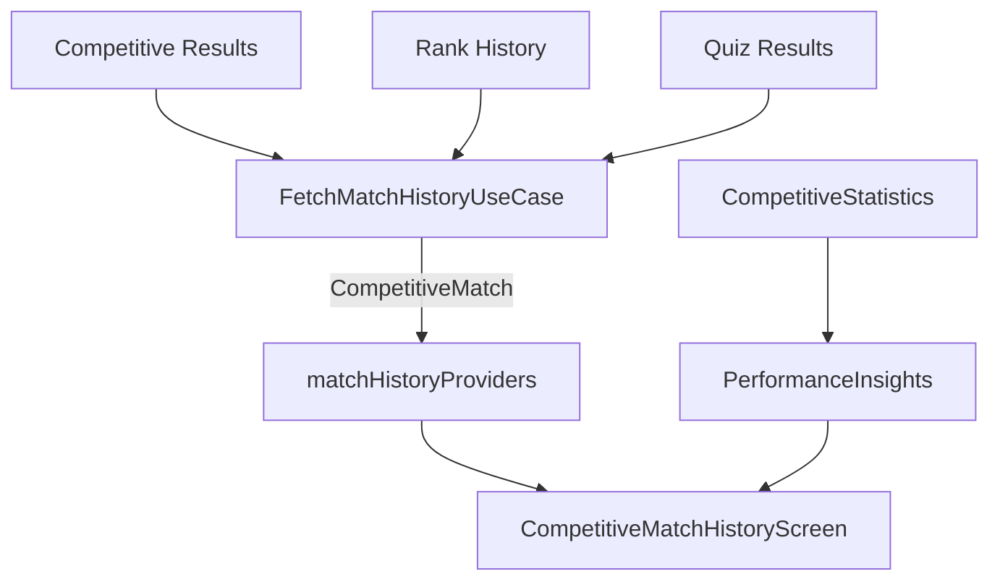

# Competitive Match History & Performance Insights

Soteria provides players with a premium record of their competitive matches and derived performance insights to help them understand their progress.

## Architecture

The system aggregates data from multiple authoritative sources to provide a unified view of each match.

### Data Flow

## Match History Model

### `CompetitiveMatch`
- `result`: The authoritative match outcome (Win/Loss, Mode, Score).
- `rankChange`: The associated rank point and tier change.
- `quizResult`: Detailed performance metrics (Accuracy, Correct Answers, Time).

## Performance Insights

Insights are generated by the `CompetitiveStatisticsService` based on recent match patterns:
- **Trend Detection**: Identifies if win rate or accuracy is improving.
- **Mode Mastery**: Highlights the player's most successful game mode.
- **Streak Status**: Recognizes active winning streaks.

> [!NOTE]
> **Deterministic Logic**: Insights are based on a minimum sample size of 5 matches to ensure statistical relevance and avoid premature trend reporting.

## Implementation Details

- **Orchestration**: `FirebaseMatchHistoryRepository` coordinates three separate data sources (`CompetitiveResult`, `RankChange`, and `QuizResult`) to construct a complete match profile while maintaining data ownership boundaries.
- **Pagination**: Uses cursor-based loading in `CompetitiveResultRepository` to handle large histories efficiently.
- **Filtering**: Supports server-side filtering by Season, Mode, and Outcome.
- **Caching**: Recent matches are cached via Riverpod providers for immediate offline access and optimized re-fetching.
- **User Isolation**: Firestore security rules ensure players can only access their own private match history.

## UI Components

- **Match History Screen**: A dedicated dashboard for summary stats and recent match cards.
- **Match Card**: Compact summary of a single result, including rank change and score.
- **Match Details Sheet**: Comprehensive breakdown of a specific match's performance.

## Security

- **Authoritative Data**: Match results cannot be modified by the client.
- **Private Access**: Private match data and opponent details are protected and only exposed where intended.
