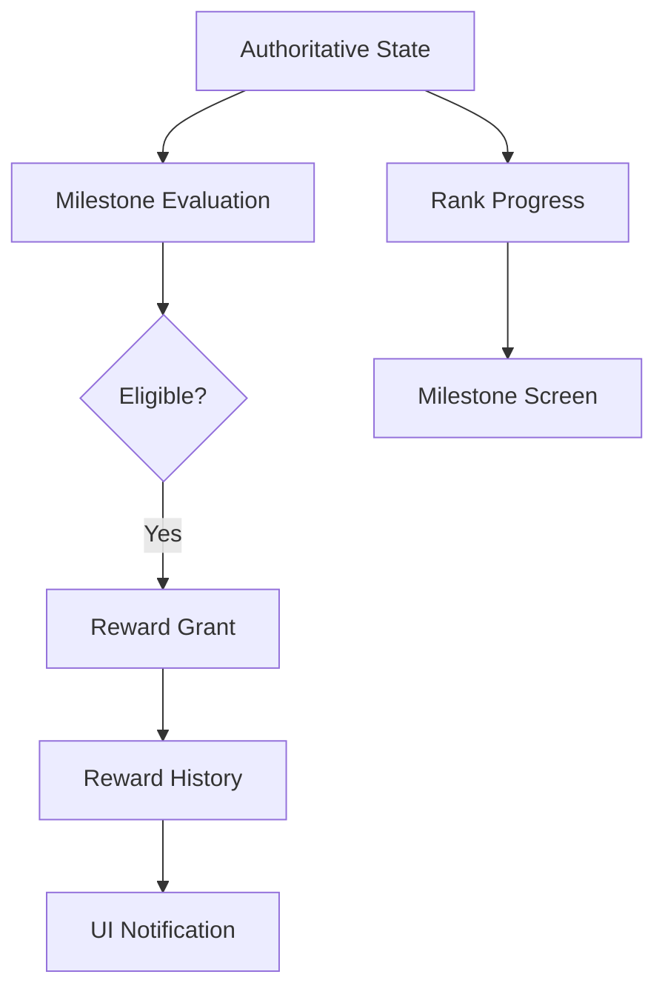

# Competitive Milestones & Rewards

Soteria rewards competitive advancement through a robust milestone system that connects rank progression to the game economy.

## Architecture

### Source of Truth
The `MilestoneEvaluationService` evaluates a player's statistics and progression against `MilestoneDefinition` items. It determines current progress and completion status.

### Reward Loop
1.  **Evaluation**: Triggered when statistics or rank change.
2.  **Granting**: If a milestone is completed, a `RewardGrant` is recorded in Firestore with status `eligible`.
3.  **Claiming**: Players must manually claim rewards from the Milestone screen.
4.  **Distribution**: Upon claim, the status is updated to `claimed`, and the server updates the player's balances (Coins, XP).

## Milestone Types

| Type | Description |
| :--- | :--- |
| `count` | Total games played milestones. |
| `win` | Cumulative victory count milestones. |
| `streak` | Win streak milestones (e.g., Hot Streak). |
| `rank` | Reaching specific tiers (Gold, Platinum, etc.). |
| `careerBest` | Achieving a new personal record rank. |
| `position` | Finish a season in Top X positions. |

## UI Components

### CompetitiveMilestoneCard
Displays milestone name, description, progress bar, and potential reward. Handles "CLAIM" action for eligible rewards.

### CompetitiveMilestoneDetails
A detailed view (Bottom Sheet) showing full requirements, reward breakdown, and achievement status.

### MilestoneCelebration
A high-fidelity celebration dialog shown after a successful reward claim.

## Integration

-   **Dashboard**: Shows the player's "Next Milestone" to maintain motivation.
-   **Profile**: Summarizes achievement count and displays latest earned badges.
-   **Activity**: Records milestone completion in the user's career timeline.

## Security & Idempotency

-   **Server Authority**: Milestone completion and reward grants are managed via server-side logic and protected by Firestore security rules.
-   **Grant Idempotency**: `grantId` is deterministic (`milestone_{id}_{userId}`) to prevent duplicate grants from repeated evaluations.
-   **Transaction Safety**: Claims are processed via Firestore transactions to ensure atomic status updates.

## Testing

Verified in `test/features/player/competitive_milestone_test.dart`:
-   In-progress evaluation.
-   Completion detection for wins and ranks.
-   Idempotency checks.
