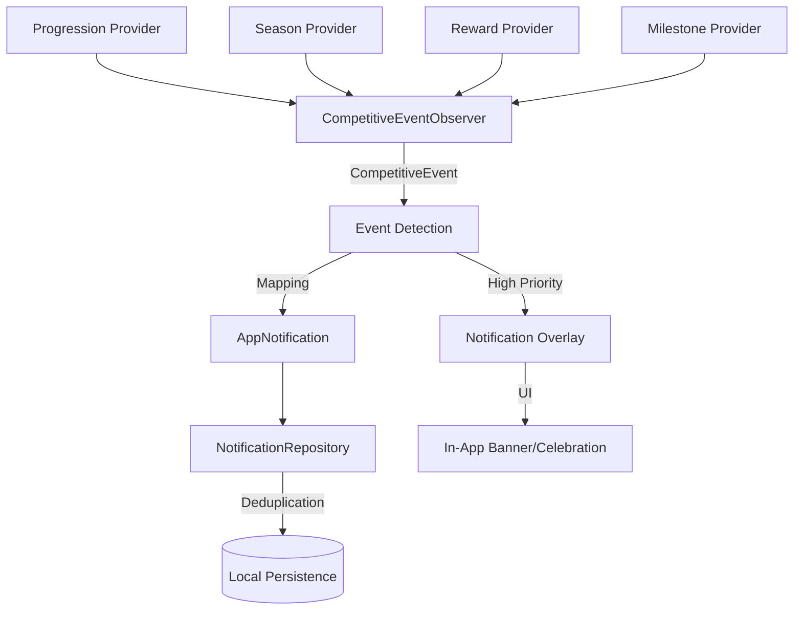

# Competitive Notifications & Event Awareness

Soteria informs players of critical competitive events through a unified notification system that integrates with both In-App awareness and Push Notifications.

## Architecture

The system uses an **Observer Pattern** to detect changes in authoritative competitive state and map them to localized notifications.

### Data Flow

## Competitive Event Types

- **RANK_PROMOTED**: Triggered when a player's rank tier increases.
- **RANK_DEMOTED**: Triggered when a player's rank tier decreases.
- **SEASON_ENDING**: Triggered when a season has less than 24 hours remaining.
- **SEASON_COMPLETED**: Triggered when a new season result is available.
- **REWARD_RECEIVED**: Triggered when a reward grant is added.
- **MILESTONE_COMPLETED**: Triggered when a competitive milestone is reached.
- **NEW_SEASON_STARTED**: Triggered when a new competitive season begins.

## Key Features

### Deduplication
Notifications use a deterministic `deduplicationKey` (e.g., `rank_change_{userId}_{tier}`) to prevent spamming the player with the same event repeatedly.

### In-App Awareness
High-priority events trigger immediate visual feedback:
- **RankPromotionCelebration**: Full-screen celebration for tier ascension.
- **LevelUpCelebration**: Recognition for player level increases.
- **NotificationBanner**: A slide-down banner for other high-priority alerts (Rewards, Milestones).

### Notification Center
A dedicated screen for reviewing all recent competitive and system notifications, support for:
- Read/Unread states.
- Category-based iconography.
- Deep linking to relevant feature screens (Profile, Leaderboard, Wallet).

## Implementation Details

- **Observer**: `CompetitiveEventObserver` watches Riverpod providers and translates state changes into events.
- **Overlay**: `CompetitiveNotificationOverlay` sits at the shell level of the app to display real-time alerts.
- **Repository**: `NotificationRepositoryImpl` handles persistence and deduplication logic.

## Security

- **Client Authority**: The client only observes state changes. All authoritative event data is derived from server-synced providers.
- **Isolation**: Notifications are user-specific and cleared on logout to ensure data privacy.
