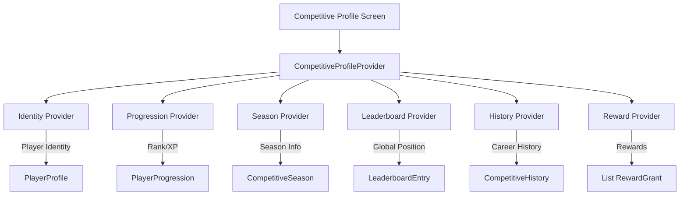

# Competitive Profile & Career Identity

The Competitive Profile is the central hub for players to view their ranking, progression, rewards, and historical performance in Soteria.

## Architecture

The system follows a Clean Architecture approach, acting as an **aggregation layer** that consumes multiple underlying systems.

### Data Flow

## Domain Models

### `CompetitiveProfile`
An immutable aggregation model that combines:
- `identity`: Player's basic profile (Avatar, Name, Level).
- `progression`: Current ranking and XP data.
- `currentSeason`: Active competitive season details.
- `globalPosition`: Current global ranking position.
- `history`: List of completed season results.
- `recentRewards`: Recently earned reward grants.
- `totalRewards`: Total count of rewards earned across all seasons.

## Providers

### `competitiveProfileProvider`
A standard Riverpod `Provider` that returns an `AsyncValue<CompetitiveProfile>`. It watches all relevant upstream providers and handles:
- **Loading State**: Active if any critical provider (Identity or Progression) is loading.
- **Error State**: Active if critical providers fail.
- **Partial Data**: Gracefully handles failure of non-critical data sources (e.g., Rewards or History) by providing empty or default values.

## UI Components

- `CompetitiveProfileHeader`: Displays identity, rank badge, and global position.
- `RankProgressSection`: Visualizes XP and Rank progression using progress bars.
- `CareerSummaryCard`: High-level career metrics (Seasons completed, Win Rate, Best Rank, Peak Position).
- `StatisticCard`: Detailed performance statistics (Games, Wins, Questions, Accuracy).
- `RewardSummarySection`: Horizontal scrolling list of recently earned rewards.
- `SeasonResultCard`: (Reused) Detailed card for historical season performance.

## Design Principles

- **Prestige**: Use of gold accents for high ranks and achievements.
- **Athletic Identity**: Layout inspired by professional sports performance dashboards.
- **Responsiveness**: Adapts from small mobile devices (320px) to tablets (1024px+).
- **Accessibility**: Support for screen readers, large text, and reduced motion.

## Testing Strategy

- **Provider Tests**: Verify data aggregation, loading states, and partial data handling.
- **UI Tests**: Verify rendering of all profile sections and state transitions.
- **Previews**: Comprehensive preview gallery in `main_preview.dart` for various player states (Ranked, Unranked, Loading, Error, Tablet).

## Privacy

The Competitive Profile only exposes public-facing competitive data. Private information such as email, transaction IDs (for payments), and notification settings are never included in the `CompetitiveProfile` model.
