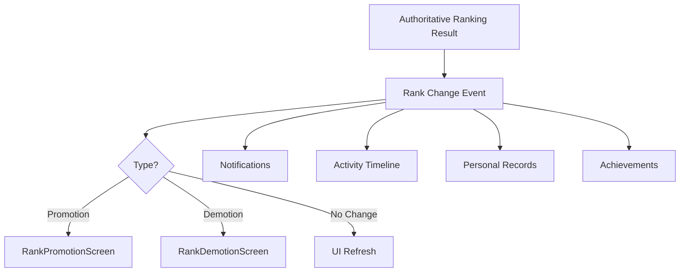

# Competitive Rank Promotion & Demotion Experience

This document describes the architecture and implementation of the rank promotion and demotion experience in Soteria.

## Overview

The rank promotion and demotion experience is designed to feel prestigious, motivating, and fair. It relies on a server-authoritative ranking system where all changes are calculated based on competitive results.

## Architecture

### Source of Truth
The `CompetitiveRankingEngine` is the authoritative source for calculating rank changes. It determines if a result leads to a:
- **Tier Promotion**: Crossing from one major tier to another (e.g., Gold to Platinum).
- **Division Promotion**: Moving up a division within the same tier (e.g., Gold III to Gold II).
- **Rank Adjusted**: A demotion or simple point change.

### Idempotency & Acknowledgment
To ensure a promotion celebration is only shown once, even if the user is offline when it occurs:
1. Every `RankChange` event is persisted in Firestore.
2. It includes an `acknowledged` flag (default `false`).
3. The app listens for unacknowledged changes via `unacknowledgedRankChangesProvider`.
4. Once the UI (celebration screen) is shown and dismissed, the app calls `acknowledgeRankChange` to update the flag.

## UI Components

### CompetitiveRankBadge
A high-fidelity emblem representation of the player's rank. Supports different tiers, divisions, and sizes.

### RankPromotionScreen
A premium, full-screen celebration for tier and division advancements. Differentiates between "Tier Ascended" and "Promoted".

### RankDemotionScreen
A respectful and encouraging screen shown when a player's rank drops.

## Integration

### Notifications (Story 9.10)
Rank changes trigger `AppNotification` events, which appear in the Notification Center.

### Activity (Story 9.11)
meaningful rank changes are recorded as `CompetitiveActivityEvent` in the user's career timeline.

### Personal Records (Story 9.15)
Reaching a career-best rank updates the personal record system.

## Testing

### Domain Tests
Verified in `test/features/player/rank_experience_test.dart`:
- Promotion detection (Tier and Division).
- Demotion detection.
- Idempotency via `acknowledged` flag.

### Preview Gallery
Fixtures for all states are available in `RankExperiencePreviews` and registered in the Preview Gallery under `Progression`.
