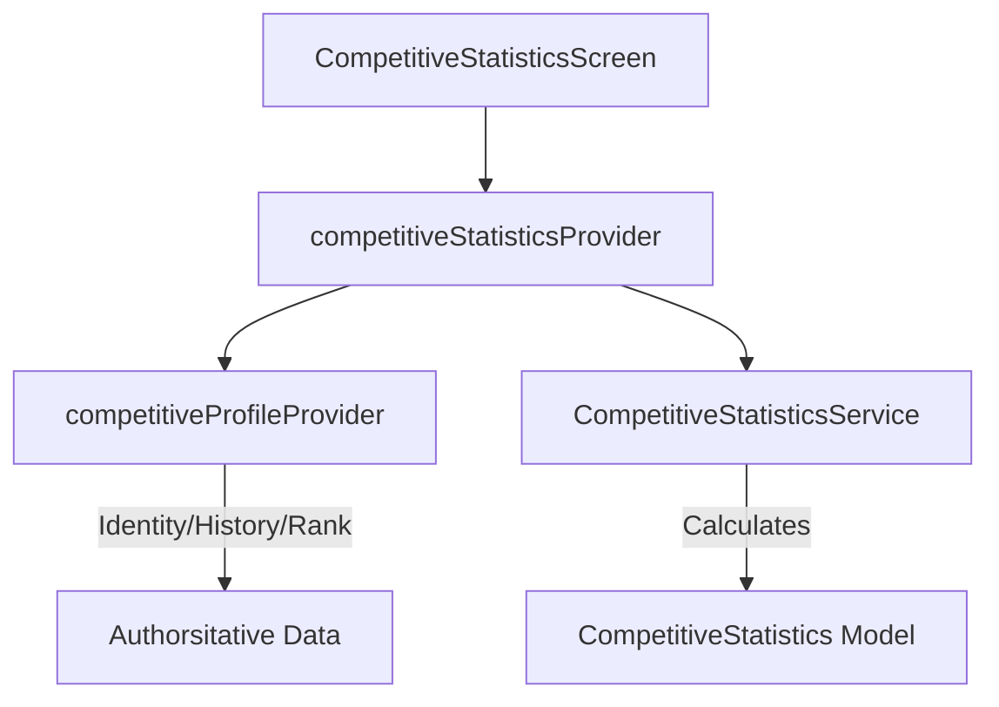

# Competitive Statistics & Performance Analytics

The Competitive Statistics system provides players with deep insights into their performance across their Soteria career and individual seasons.

## Architecture

This feature acts as a **Read Model / Analytics Layer**. It aggregates data from authoritative systems but does not own or modify the source data.

### Data Flow

## Domain Models

### `CompetitiveStatistics`
The root aggregation model containing:
- `career`: Lifetime metrics (Games, Wins, Win Rate, Accuracy, Streaks).
- `currentSeason`: Stats for the active season.
- `trends`: Calculated performance trends (Improving, Stable, Declining).
- `insights`: Deterministic, rule-based performance highlights.
- `recentForm`: A list of recent match outcomes (e.g., 'W', 'L').

## Trend Algorithm

Trends are determined by comparing the **Latest Season** performance with the **Previous Season**.

- **Improving**: Change percentage > +5% (or +2% for Accuracy).
- **Declining**: Change percentage < -5% (or -2% for Accuracy).
- **Stable**: Change within the threshold.
- **Insufficient Data**: Fewer than 2 seasons of history.

## Intelligent Insights

Insights are deterministic and based on career milestones or recent performance:
- **Win Rate Highlights**: Recognition for win rates > 50% or > 70%.
- **Consistency**: High accuracy streaks.
- **Winning Streaks**: Current form recognition.
- **Veterancy**: Competing in many seasons.

## UI Components

### `WinRateCard`
A high-impact card displaying the win rate with a radial progress indicator and win/loss counts.

### `PerformanceTrendWidget`
Visualizes a metric's trend over time using a sparkline and a status badge.

### `RecentFormWidget`
Shows the outcome of the last 8 matches in a compact row of indicators.

### `PerformanceInsightWidget`
Displays rule-based feedback to the player with helpful tips.

## Performance & Scalability

- **No N+1 Reads**: Data is fetched as a single profile aggregation.
- **Cached Calculations**: Statistics are calculated once when the provider's dependencies change.
- **Efficient History**: Only the last 5 seasons are used for sparkline data points to maintain performance.

## Accessibility

- **Semantics**: All charts and badges have textual descriptions for screen readers.
- **Reduced Motion**: Count-up animations and intensive transitions are disabled when `MediaQuery.disableAnimations` is true.
- **Scalable Text**: Layouts are designed to handle up to 1.5x text scaling without overflow.
