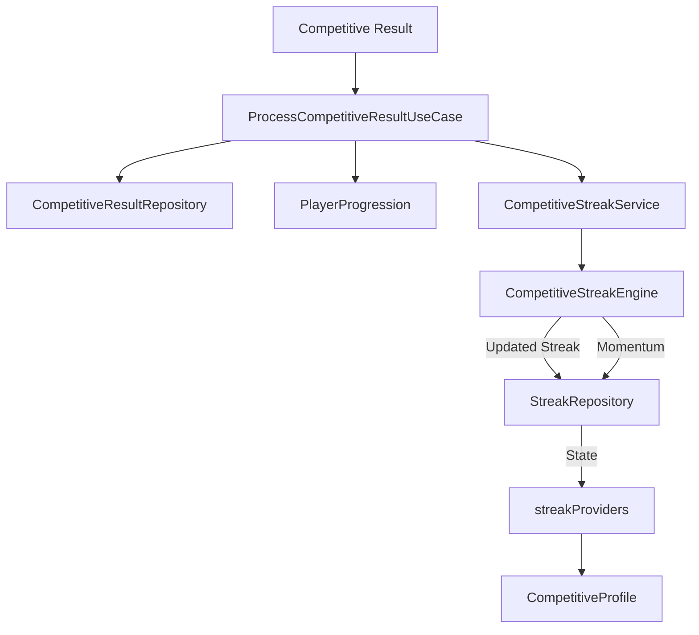

# Competitive Streaks & Momentum System

Soteria implements a robust streak system to reward consistent performance and track player momentum throughout their competitive career.

## Architecture

Streaks are derived from authoritative competitive results and maintained as persistent state to ensure integrity and scalability.

### Data Flow

## Win Streak Rules

- **Increment**: A streak increases by 1 for every qualifying competitive **WIN**.
- **Reset**: A streak resets to 0 upon any competitive **LOSS**.
- **Pause**: Draws, placements, or cancelled matches do not increment or reset the streak; they maintain the current state.
- **Bests**: The system tracks Career Best, Season Best, and Current streaks independently.

## Momentum System

Momentum is a derived presentation layer that reflects a player's recent performance trajectory.

### Momentum States

- **NONE**: No recent activity.
- **BUILDING**: Starting to show consistent participation/wins.
- **STRONG**: Sustained high-performance (e.g. 3+ wins in a row).
- **PEAK**: Dominant performance (e.g. 5+ wins or multiple S-tier ratings).
- **COOLING**: Recent setbacks following a peak.

## Integration

- **Goals**: Streak data is consumed by the Goal system (Story 9.12) to evaluate "Reach X Streak" objectives.
- **Achievements**: Major streak milestones trigger permanent career accomplishments.
- **Notifications**: Players are notified of significant streak events (e.g. "5 Wins in a row!").
- **Activity Feed**: Streak milestones and new personal bests are recorded in the career timeline.

## Security & Integrity

- **Server Authority**: Streak calculation logic resides in protected services. Clients cannot directly modify streak values.
- **Idempotency**: Results are recorded with unique IDs, and streak updates are processed once per result to prevent double-counting.
- **User Isolation**: Streak data is strictly siloed by User ID and cleared upon logout.
