# Soteria Navigation Map

```mermaid
graph TD
    subgraph "Root Flow"
        AppStartup["Native Splash (Startup)"]
        Onboarding["Onboarding (/onboarding)"]
        Perso["Personalization (/personalization)"]
        Auth["Auth Hub (/auth)"]
    end

    subgraph "Stateful Shell (Bottom Nav)"
        Home["Home (/app)"]
        Play["Play Hub (/app/play)"]
        Leader["Leaderboard (/app/leaderboard)"]
        Wallet["Rewards (/app/wallet)"]
        Profile["Profile (/app/profile)"]
    end

    subgraph "Dashboard Sub-Routes"
        Practice["Practice (/app/practice)"]
        Pro["Pro Mode (/app/pro-mode)"]
        Versus["Versus (/app/versus)"]
        Tourn["Tournament (/app/tournament)"]
        Settings["Settings (/app/settings)"]
    end

    AppStartup --> Onboarding
    Onboarding --> Perso
    Perso --> Auth
    Auth --> Home

    Home --- Play
    Home --- Leader
    Home --- Wallet
    Home --- Profile

    Home --> Practice
    Home --> Pro
    Home --> Versus
    Home --> Tourn
    Home --> Settings
    Home --> Notifs["Notifications (/notifications)"]

    %% Transitions
    style Home fill:#2A1B54,stroke:#7047EB
    style Settings fill:#1A1A1A,stroke:#FFD700
    style Notifs fill:#1A1A1A,stroke:#FFD700
```

## Interaction Logic
1. **State Preservation**: The `Home`, `Play`, `Leaderboard`, `Wallet`, and `Profile` branches maintain their own state and scroll position using `StatefulNavigationShell`.
2. **Back Navigation**: Modal-style screens like `Settings` and `ComingSoon` use `Navigator.pop()` to return to the previous context, while feature navigation uses `context.push()`.
3. **Analytics**: Every navigation event is intercepted by `NavigationCoordinator` and logged to the analytics service.
