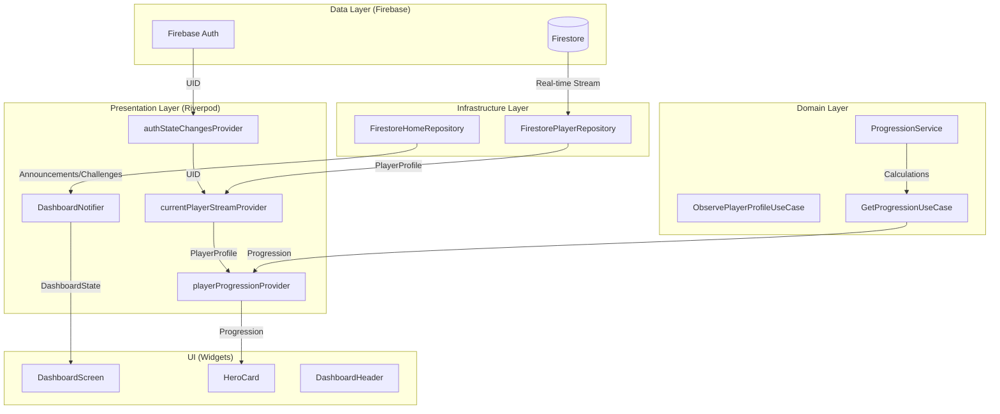

# Dashboard Data Flow

## Flow Description
1. **Authentication**: `authDataSourceProvider` detects the user's UID.
2. **Observation**: `ObservePlayerProfileUseCase` starts a real-time Firestore listener for that UID.
3. **Synchronization**: When Firestore updates, `currentPlayerStreamProvider` emits a new `PlayerProfile`.
4. **Calculations**: `playerProgressionProvider` passes the profile to `GetProgressionUseCase`, which uses `ProgressionService` to calculate Level, XP, and Profile Completion.
5. **Animation**: UI widgets receive the new state and trigger `AnimatedNumericCounter` and `XPProgressIndicator` transitions.
6. **Offline**: If the network fails, Firestore returns cached data via the same stream, and the `sessionProvider` flags `isOffline`, showing the dashboard indicator.
