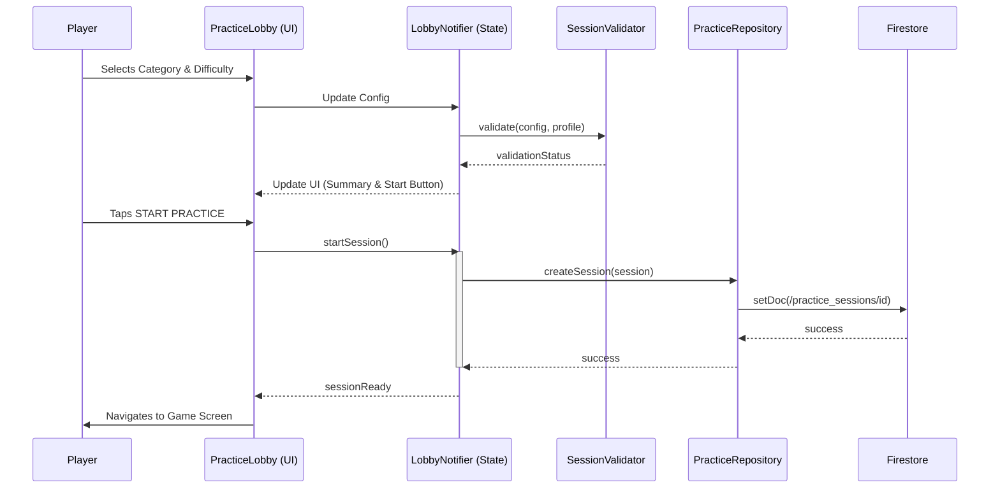

# Session Initialization Flow

## Error Handling
- **Network Failure**: Session metadata is stored with Firestore offline persistence enabled; the game can proceed if questions are cached.
- **Validation Failure**: The "START" button is disabled and a clear error message is displayed (e.g., "Level 10 required").
